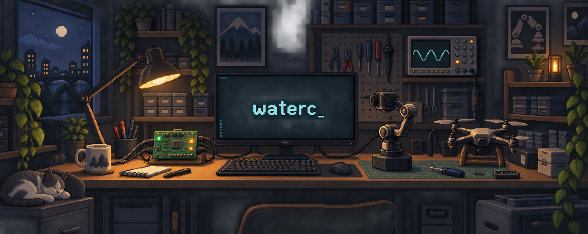

写代码，调机器人，把想法做成实物。

### 关于我

- 🎓 西交利物浦大学机器人工程在读 · RoboMaster 电控
- 🔧 主要折腾嵌入式开发、电机控制与机器人系统联调
- 🌱 正在探索小型自主无人机、机器人感知和 AI Agent

### 工具箱

  

STM32 · FreeRTOS · CAN / UART · PX4 · MAVLink

### 工作台上的项目

[折叠云台](https://github.com/waterc07/foldable_gimbal) · [英雄机器人](https://github.com/waterc07/2026_hero) · [AI 多智能体探索](https://github.com/waterc07/TradingAgentsFusion)

---

保持好奇，动手实践。

